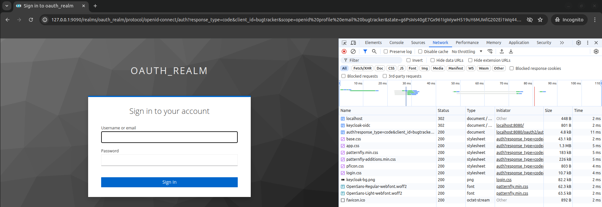
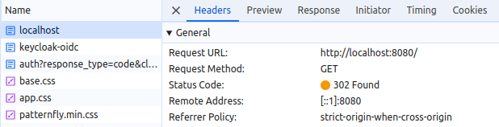
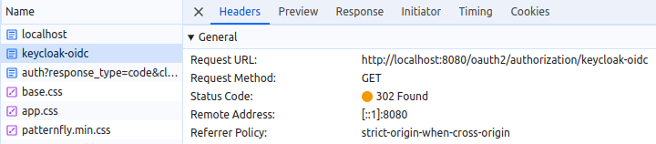
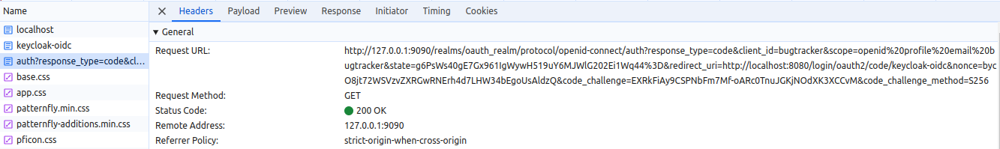
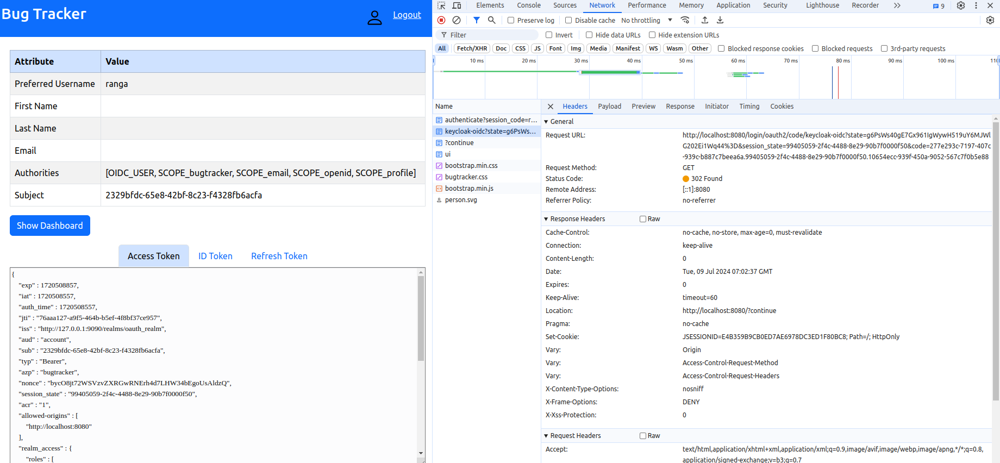
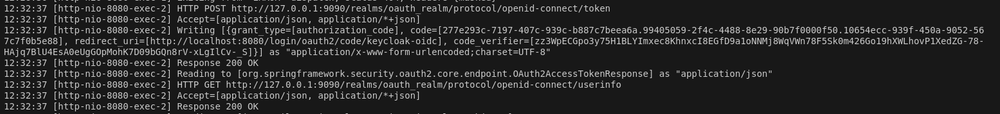

# Authorization Code Grant
Open an incognito window along with the developer console.

Reason for using incognito is the application of an administrator logged in another window.

When we try to open the Bug tracker application, it redirects us to the login page of Keycloak

On the right, we can see this is the request that we sent to the application and there is a 302 not found, which is basically a redirect request.

So it is redirected to Keycloak Oidc.

So when we click that, we'll see the request to keycloak-oid.

That is the login request and recognizes that it has to go to Keycloak.

That's why there's a 302 not found and needs to be redirected again.

Here, in the authorized endpoint, we can see the correct authorization endpoint, response type, client ID and so on.

For additional security, a randomly generated state parameter is also sent.

We will see that state parameter again when the response is returned later, because those need to match.

Nonce is part of the OpenID specification and that's also a randomly generated ID. 

When we get the access token, ID token and refresh token, we will see the nonce embedded inside those tokens.

It should match what was sent as part of the authorized request. If not, the response should be rejected.

After signing into the application, state parameter that was sent as part of the request is matched here in the redirect URL.

Also, we get the authorization code from this URL, which will go to the token request and get the ID token, the access token and the refresh token.

From the log data, we can see a token request being sent with authorization code, and then the code being sent as part of the token request to actually get the token.
