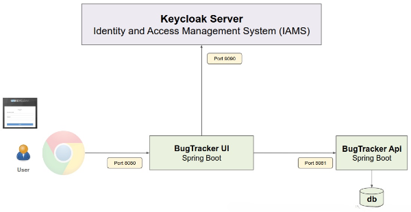
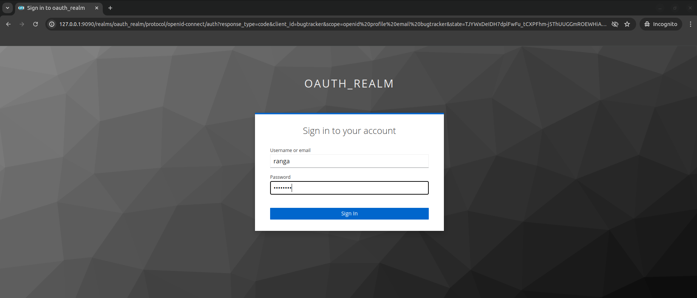
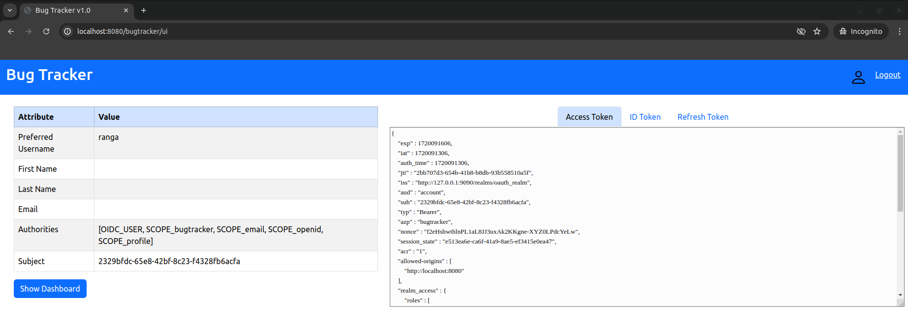

# Bug Tracker Application
Bug tracker application is going to be a spring boot application, which supports the functionality of an OAuth client.

This bug tracker application runs on port 8090, since BurpsuitePro runs on 8080 on the same desktop.

There are two phases of Bug Tracker application - Bug Tracker UI and Bug Tracker API
1. The UI will be handled by the bug tracker UI application. This is the Spring Boot Controller class, and all the Http requests are first routed to this controller.

2. Any business logic related to the bug tracking will actually be moved to the Bug Tracker API project. The bug tracker API itself will be a Spring Boot Resource server.

As of now, we do not have a database. Everything which is created will be stored in memory within the bug tracker service object.
	
Essentially, the bug tracking service will act like an in-memory database.
# Demonstration
Logging onto the localhost:8080, we will be redirected to Keycloak login screen

**How did that happen?**

The URLs in this application are protected.

So the application immediately started the authorization code flow, which means it redirected to the keycloak authorization server, because that's the way it is set up in spring Boot.

Log in using one of the users that we created.

When logged in, we'll see the following homepage.

Subject is a unique identifier for the user assigned by Keycloak.

Authorities is spring security specific, which basically maps directly to the privileges in the application.

On the right, lies the tokens. Only the body of the token is displayed, not the headers. 

In practical use, we don't display these tokens due to security reasons. 

**Global Logout**

On the right top corner, we could see a logout button. Clicking on logout button, will get us back to keycloak login screen.

This is a global logger, allowing us to not only log out from the application and destroy the session along with cookie removal, it also sends a redirect message to Keycloak to log out from Keycloak as well.

So next time when we try to access the application, we will see the login screen.
