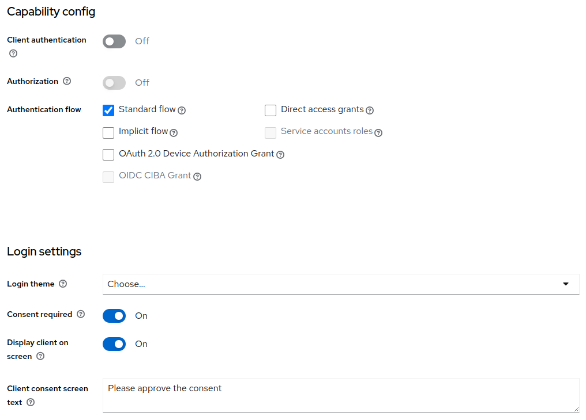
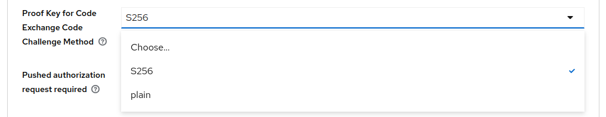
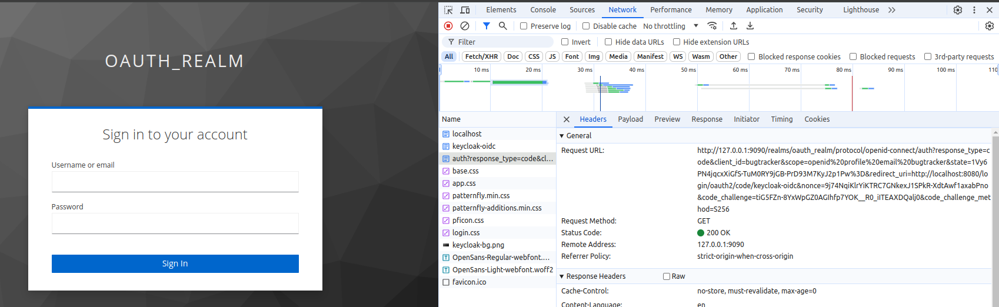
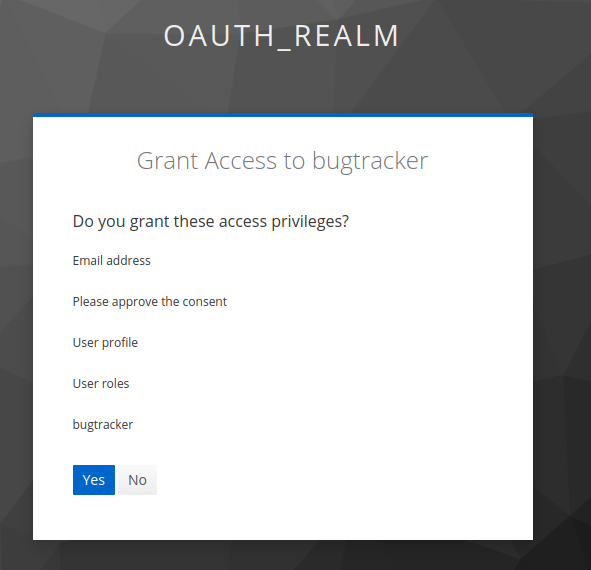
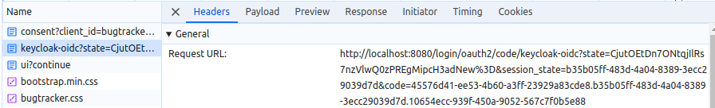
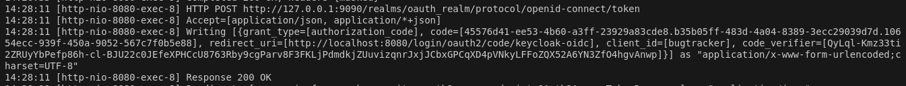

# Bug Tracker with PKCE
Since we know that PKCE was originally designed so that public clients could use a Code verifier, we are disabling the Client configuration option to make it a public client. 

We also select the option of consent required, requiring the user to actually authorize the request.

Also, select the PKCE challenge method as S256 and save it.

We don't need client secret because there is no client secret again. But we will need a client authentication method as none. 

This is basically telling Spring Boot that this is a public client.

<pre><code>
# KeyCloak specific OAuth 2 related properties
spring.security.oauth2.client.registration.keycloak-oidc.provider=keycloak
spring.security.oauth2.client.registration.keycloak-oidc.client-name=bugtracker
spring.security.oauth2.client.registration.keycloak-oidc.client-id=bugtracker
# spring.security.oauth2.client.registration.keycloak-oidc.client-secret=VNGk0BtyvKfdwwd8efcjdzr8YisJSEEL
spring.security.oauth2.client.registration.keycloak-oidc.client-authentication-method=none
spring.security.oauth2.client.registration.keycloak-oidc.authorization-grant-type=authorization_code
spring.security.oauth2.client.registration.keycloak-oidc.scope=openid,profile,email
</code></pre>
  
Accessing the application we can see that the code challenge being sent as well as the code challenge method.

This is a sign that PKCE is working.

It is now asking for authorization and then clicking yes will direct us to home page.

Code verifier is displayed in the request url and in the console logs as shown below

It sent a Post request to token out here and then we see the code verifier being sent.

This indicates that PKCE is working great.
