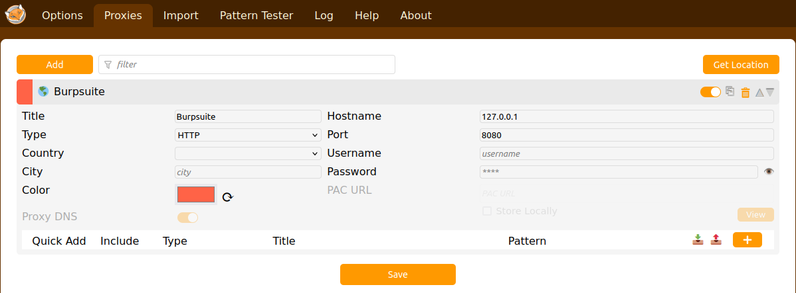
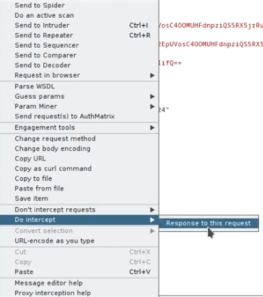

# Intercept HTTPS Requests & Responses
In the context of web security testing, intercepting HTTP requests and responses between applications can be crucial for identifying vulnerabilities and ensuring secure communication. 

We are now intercepting HTTP traffic between a Keycloak server (used for authentication and authorization) and a bug tracker application (for issue tracking and project management) using Burp Suite Pro. 

Burp Suite Pro is a powerful tool for performing security testing of web applications and foxyProxy assists in managing proxy configurations. It includes features for intercepting, analyzing, and modifying HTTP/HTTPS traffic, making it an essential tool for security professionals. 

## Environment Setup

**Keycloak server**: Hosted on a virtual machine (VirtualBox)

**Bug tracker application**: Installed on a desktop computer

**Burp Suite Pro**: Installed on the same desktop as the bug tracker application. Pre-requisite: JRE version 8 or later

**FoxyProxy**: Browser extension installed in the desktop computer

Configure foxyproxy to run in same port as BurpsuitePro and enable it

Ensure that the virtual machine hosting Keycloak and the desktop running the bug tracker application can communicate with each other.
## Attaching a CA Certificate in Burp Suite Professional

Attaching a CA certificate is essential for enabling Burp Suite Professional to intercept and inspect HTTPS traffic.

**Why?**

1. HTTPS encrypts web traffic to secure it. Burp Suite acts as a man-in-the-middle to intercept and analyze this traffic. To decrypt and inspect HTTPS traffic, Burp Suite generates and uses its own SSL/TLS certificates signed by its CA certificate.

2. Without the CA certificate, Burp Suite’s generated certificates would trigger security warnings in the browser because they are not recognized as trusted.

**Steps to Attach the CA Certificate**

In Burp Suite, navigate to the “Proxy” tab > “Options” > “Import / export CA certificate” and export the CA certificate in DER format.

* Open browser settings and navigate to Certificates.
* Select View Certificates and choose Import Certificate.
* Locate and import the exported CA certificate file.
## Authentication Flow

Open a new browser tab and navigate to bug tracker application URL (10.21.232.132:8090). It will be redirected to the Keycloak authorization URL (10.21.232.41:8080)

On clicking 'Sign In', we can find the username and password of the user is visible in the Burpsuit application along with session code, client ID, cookie, etc.

Intercept the response to this request

Click forward to proceed. No change is observed in the application side as the response is stopped in Burpsuite. 

Click forward to process the response from Burpsuite to application.

We can see that the page is not fully loaded. Click forward to process it.

