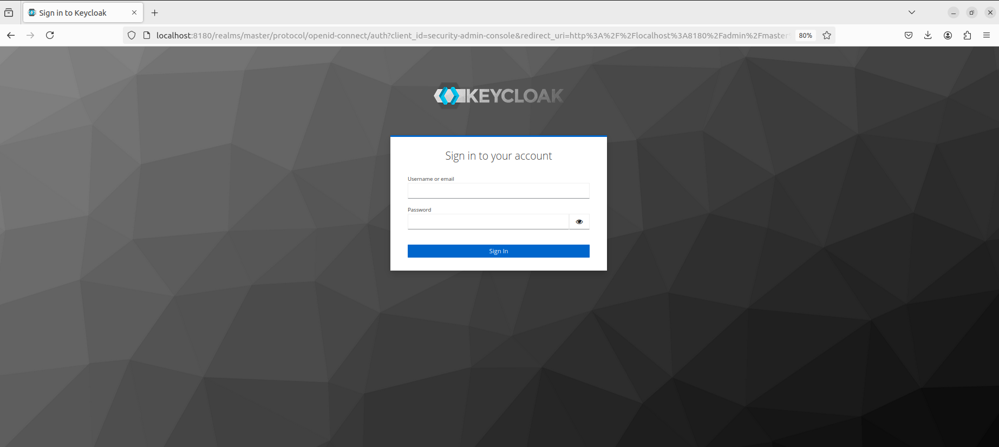
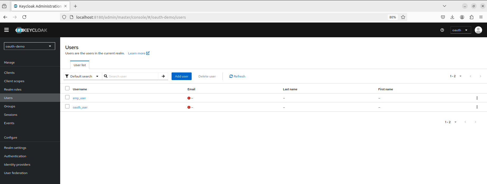

# OAuth
## What is OAuth?
Open Authorization is an open standard protocol for authorization of an application using user information. In general, it allows a third party application access to user related info like name, DOB, email or other required data from an application like Facebook, Google etc. without giving the third party app the user password.

## Keycloak
* It is an open source Identity and Access Management solution.
* It offers features such as Single-Sign-On, Identify Brokering and Social Login, Client Adapters and Account Management Console.
* Some alternatives are Okta and Forgerock

Advantages:-
1. Open source
2. Easy customization - configurations
3. JSON web token - easy to transfer
4. OpenID and SAML support - standards for SSO
5. Supports multiple identity provider

**Installation and Setting**

Keycloak can be installed from https://www.keycloak.org/downloads

In Keycloak 17 and later, the traditional standalone.sh script has been replaced with kc.sh. This script is used to manage the Keycloak server, including starting, stopping, and configuring the server.

This starts the Keycloak server in development mode. Development mode typically runs without HTTPS enabled, allowing for easier local testing without the need for SSL certificates and uses an in-memory database by default. This means all data is lost when the server stops. It's convenient for testing but not suitable for persistent storage needs.

**Components of Keycloak**
1. Realm 
* A realm in Keycloak acts as a management entity that controls a specific set of users, their credentials, roles, and groups.
* It allows for the isolation of data and configurations so that multiple organizations or applications can be managed independently within the same Keycloak instance.

2. Clients
* Clients are entities such as applications or services that can request authentication from users.
* They initiate the authentication process and redirect users to Keycloak for login.

3. Roles
* Roles in Keycloak serve as identifiers for the type or category of a user.
* They help define what actions a user is permitted to perform within the system by assigning permissions associated with specific roles.

4. Users
* Users in Keycloak represent individual user accounts that can log in and interact with the system. 
* Each user has a unique set of credentials used for authentication.

