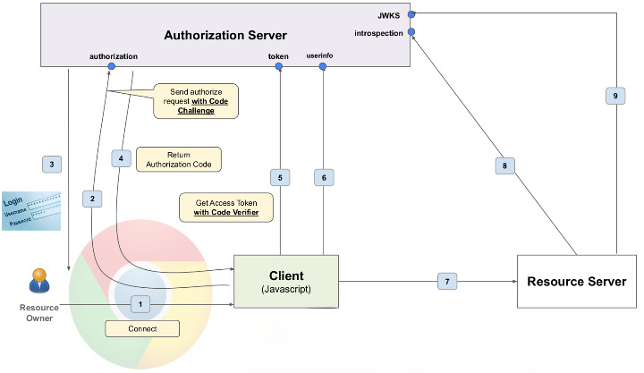

# Proof Key for Code Exchange
**What is the necessity to use PKCE?**

The primary issue with authorization code grant type for public clients is the case where a malicious user intercepts the authorization code and somehow knows about the client ID and secret, then that user can use the token endpoint to get an access token, effectively hacking into the resource API.

Since the client secret is not secure for public clients and can be easily obtained by an attacker, relying on it provides no real security.

**Proof Key for Code Exchange**
* Client generates a random code verifier string
    * Unique for that authorized request
    * Min = 43 chars and Max = 128 chars
    * Random and impractical to guess

* Once the code verifier is generated, the client generates the code challenge from the code verifier

<strong>code_challenge = BASE64URL-ENCODE(SHA256(ASCII(code_verifier)))</strong>

* Most importantly, we can go from code verifier to code challenge, but not vice-versa due to the inability to get to the original data from hashed SHA256 data.

This is the same diagram with minor changes when the user clicks on the connect button and just before the authorized request is sent, the client will generate this random code verifier.
1. The code challenge is created and is sent as part of the authorized request, as part of request 2.

2. The authorization server will generate an authorization code and return the authorization code as part of request 4 as before, but the authorization server will also associate the code challenge with the auth code.
3. Now, when the client sends a token request, it will also send the code verifier.
4. The authorization server will then convert the code verifier to the code challenge using the same Sha256 algorithm.
5. If the code challenge matches with that sent as part of 2, then the authorization server knows that the request is legitimate and it returns the token back.

Code verifier acts like a dynamic secret, only for that particular authorized request for the next authorization request, a different code verifier will be generated by the client.

Using a library like Spring Boot, code verifier and code challenge are automatically generated.

PKCE is recommended for confidential clients as well. When used with confidential clients, the token request would be sent with the client secret as well as the code verifier.
