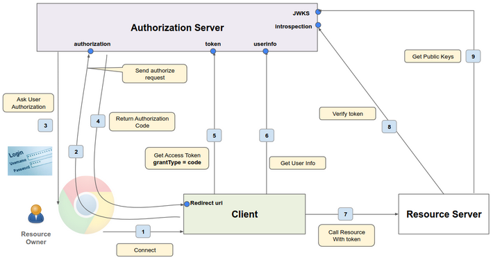

# Access Token
**What is an access token?**
* An access token in OAuth (Open Authorization) is a credential that is used to authenticate and authorize API requests.
* Expiry date of the access token can be extremely low of the order of 30 seconds to 5 minutes.

Access Token is divided into 
1. Opaque Token - 1d52703551c84012a7b0af0930092ea6

2. Structured Token (JWT)

**Structure of JSON Web Token**

// THIS IS THE BODY OF JWT WITHOUT HEADER AND SIGNATURE

{

"exp" : 1700941502,

"iat" : 1700941202,

"auth_time" : 1700941202,

"jti" : "47f9ecbc-f221-4228-acd9-df15f604cb5a",

"iss" : "http://127.0.0.1:9090/realms/oauthcourse",

"sub" : "2fc9115f-75c8-4eea-b1d3-3edd0f3598c2",

"typ" : "Bearer",

"azp" : "bugtracker",

"nonce" : "jvDZ6MnJ7NHJNY2LnuwEXoExnFnppd29ggGa50G0a3c",

"acr" : "1",

"scope" : "openid profile bugtracker.admin email",

"sid" : "15597759-7c5e-4941-945d-629ddf607403",

"email_verified" : false,

"name" : "John Doe",

"preferred_username" : "johndoe",

"given_name" : "John",

"family_name" : "Doe"

}

# Architecture Diagram

## Procedure
* Main players in the diagram are resource owner, client, authorization server and resource server.
* Here, user has already logged into the application that is, the client.
* Now we call this resource API to get the resources associated with the resource owner.
* We can think about the client as some image editing software.
* The authorization server as the Google authorization server, and the resource server as the Google Photos API.
* First, user or resource owner will send the request to connect to the resource server or get the photos of the resource owner.
* So the client does not know what to do with this and so the client will send an authorized request to the authorization endpoint of the authorization server, asking for the permission to call the resource server on the user's behalf.
* Authorization request is asking the authorization server to get that authorization from the resource owner.
* Here, if the user has not already been authorized before, the authorization server will first ask for the user credentials and then specifically ask for permission.

* Here, authentication is not for logging into our application as we have already logged into the application by other means.
* The authentication here is only to allow the user to authorize the request to access the resource server.
* After the resource owner approves it, the authorization server will send a short-lived authorization code (Order of 30s) to the client at its redirection Uri.
* Also, to authorization server know the redirect Uri when the client was registered, we also provide redirect Uri as part of the registration, basically telling it where to send the authorization code when the authorization request comes in.
* Client will then send a request to the token endpoint of the authorization server with a grant type of code, and specify the authorization code as part of that request, exchanging the authorization code for an access token.
* In doing so, the client will have to specify the client ID and the client secret as well, because the authorization server needs to authenticate the client itself.

**Why the authorization server does not send the access token directly to the client instead of sending the authorization code?**
* The reason for this is security.
* The client is not dealing directly with the authorization server. There's a browser in the middle.
* It's going through this browser and that makes it less secure.

* This whole path via the browser is called the front channel and we do not want to expose our access token in that front channel.
* That's why an authorization code is sent in the front channel and later on, this authorization code is exchanged with the access token in the back channel.
* The back channel here being the direct communication between the client and the authorization server.

**How does the Resource Server verify the token?**
* If the token is an opaque token, then the resource server will call the authorization server introspection endpoint to make sure that the access token is valid.
* If the token is a JWT token, then the resource server can do the verification itself.
* As a part of the verification, it will have to do some important checks the signature verification, the expiry time check and some other checks.

* The resource server needs a set of public keys to verify the access token.
* These public keys are provided by the authorization server (the server that issued the access token) through a special endpoint called the JWKS (JSON Web Key Set) endpoint.
* The access token has three parts: header, payload, and signature.
* The header of the access token includes a reference to which public key was used to sign the token. This reference is called the Key ID (KId).
* The resource server looks at the KId in the token's header.
* It then finds the corresponding public key from the list of public keys retrieved from the JWKS endpoint.
* Once the correct public key is identified, the resource server uses this key to verify the token's signature.
* If the signature is valid, the token is considered authentic and the resource server can trust the claims (like user identity and permissions) in the token's payload.

**Does that mean that we have to go through this entire process to get an access token every five minutes?**

No, here comes the refresh token. If the access token has expired, the client can make a call to the token endpoint again with a grant type of refresh token to get another access token.

A refresh token has a much higher expiry time, at least until the web session ends - let's say 30 minutes.

**Limitations**
* This architecture works great if the client or the application is on the back end.
* When the client is running inside the browser or a mobile application, it is considered a "public client".
* This means it cannot safely store secrets because the client-side environment (browser or mobile app) can be accessed and potentially manipulated by end-users.
* To address this issue, the OAuth 2.0 protocol has an extension called PKCE (Proof Key for Code Exchange).
