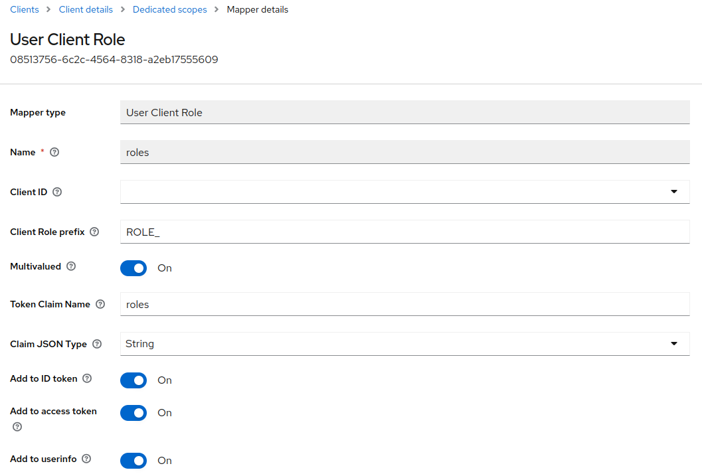

# BugTracker Authorization using Roles
* Not all authorization servers are made equal. Keycloak is provided with the ability to map roles to scopes.
* This enables us to use scopes in enterprise applications without making changes to Spring Boot's default handling of scopes.
* Authorization servers like Okta do not support this mapping.

By default, Spring Boot simply takes what is there in the scope claim and creates an authority by prefixing it by scope underscore.

Instead of Anyauthority, we assign Anyrole and remove the ROLE_ prefix before each role assigned before. 

<pre><code>
@Bean
    public SecurityFilterChain filterChain(HttpSecurity http)
            throws Exception {

            http
                .authorizeHttpRequests(authorize ->
                        authorize
                                .requestMatchers("/bugtracker/ui").authenticated()
                                .requestMatchers("/bugtracker/ui/admin/**").hasAnyRole("bugtracker.admin")
                                .requestMatchers("/bugtracker/ui/**").hasAnyRole("bugtracker.admin", "SCOPE_bugtracker.user")
                                .anyRequest().authenticated())
</code></pre>

We can remove two bug tracker admin and user scopes.

Now, if we login through any of the user, we find that the scope is not included. Only openid, email and profile

